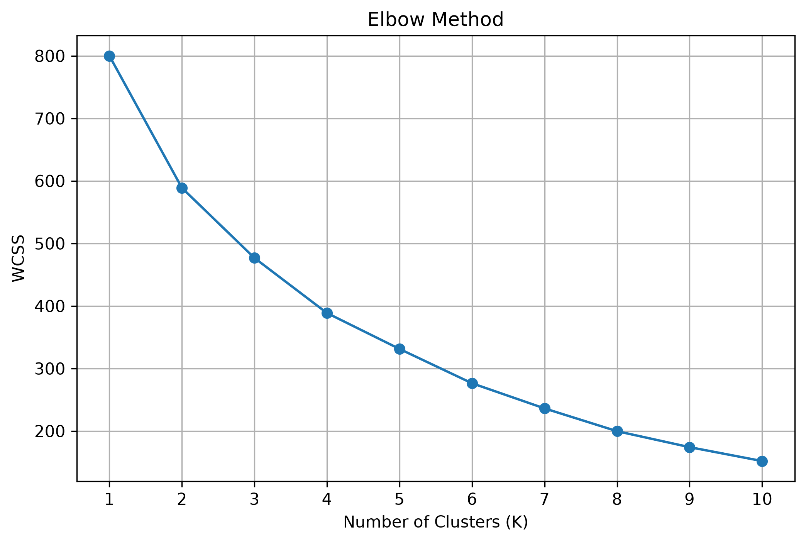
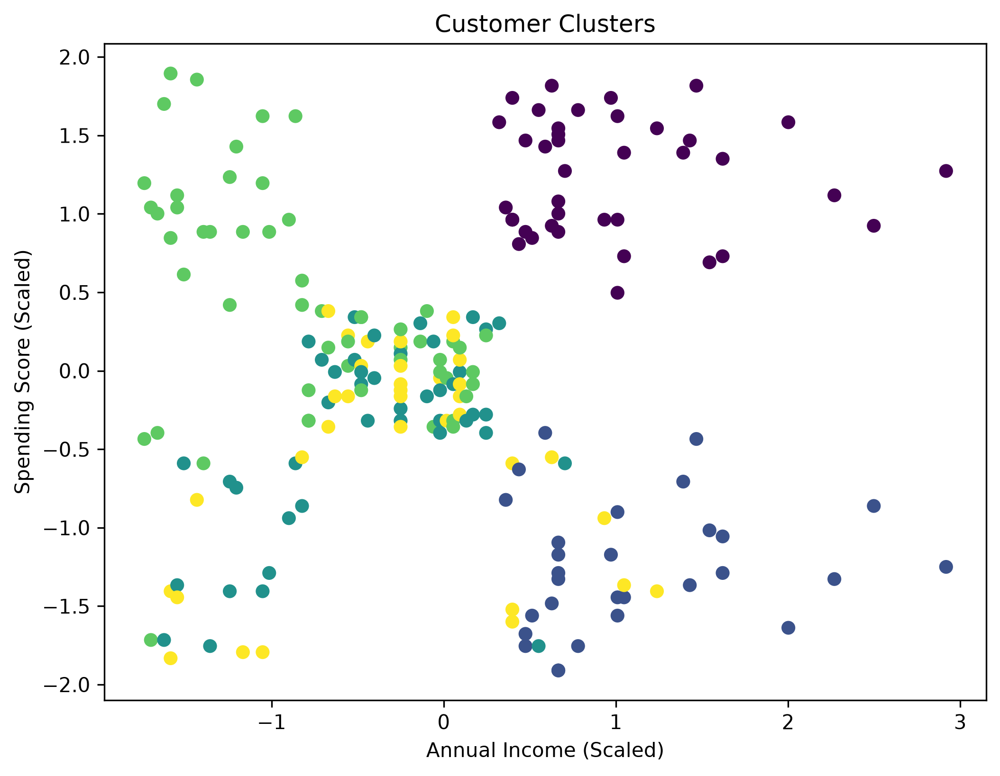
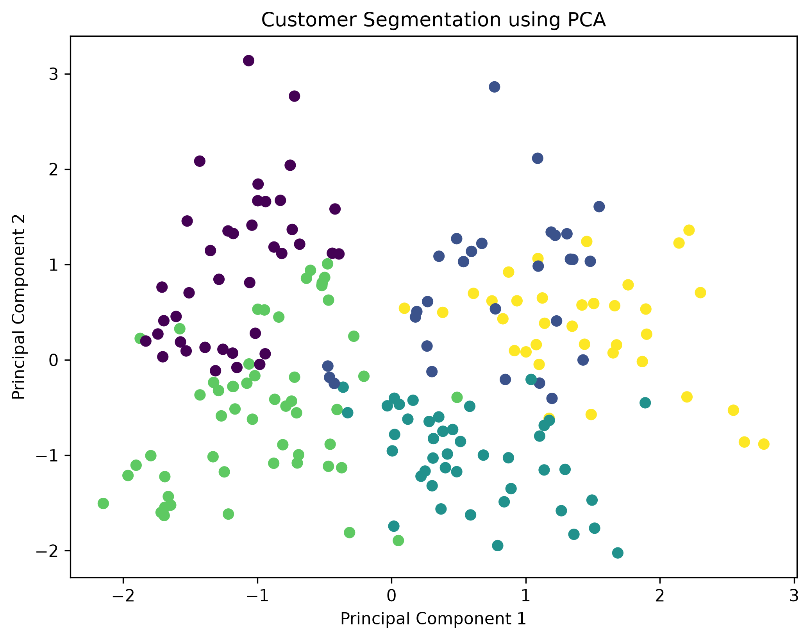

# Customer Segmentation using K-Means Clustering and PCA

## Objective

The objective of this project is to segment mall customers into different groups using the K-Means Clustering algorithm and visualize the customer segments using Principal Component Analysis (PCA). Customer segmentation helps businesses understand customer behavior and develop targeted marketing strategies.

---

## Dataset Link

Mall Customer Segmentation Dataset

https://www.kaggle.com/datasets/vjchoudhary7/customer-segmentation-tutorial-in-python

---

## Libraries Used

- Pandas
- NumPy
- Matplotlib
- Scikit-learn

---

## Methodology

1. Loaded the Mall Customer Segmentation dataset using Pandas.
2. Explored the dataset by displaying the first five records, dataset information, and summary statistics.
3. Checked for missing values.
4. Removed the `CustomerID` column.
5. Encoded the `Gender` column into numerical values.
6. Standardized the numerical features using `StandardScaler`.
7. Applied the Elbow Method to determine the optimal number of clusters.
8. Trained the K-Means Clustering model using the selected value of K.
9. Assigned cluster labels to each customer.
10. Applied Principal Component Analysis (PCA) to reduce the dataset to two principal components.
11. Visualized the customer clusters and PCA projection.

---

## Results

The Elbow Method indicated that **5** is the optimal number of clusters for the given dataset. The K-Means algorithm successfully grouped customers into five different segments based on their income and spending behavior. PCA reduced the dataset to two dimensions, making it easier to visualize the customer groups while preserving most of the important information.

### Output Images

#### Elbow Curve

#### Customer Clusters

#### PCA Visualization

---

## Conclusion

Customer segmentation was successfully performed using the K-Means Clustering algorithm. The Elbow Method helped determine the optimal number of clusters, while PCA reduced the dataset into two principal components for visualization. The identified customer groups can be used for targeted marketing campaigns and better business decision-making. One limitation of K-Means is that the number of clusters must be selected before training. An advantage of PCA is that it simplifies high-dimensional data while preserving most of the important information.